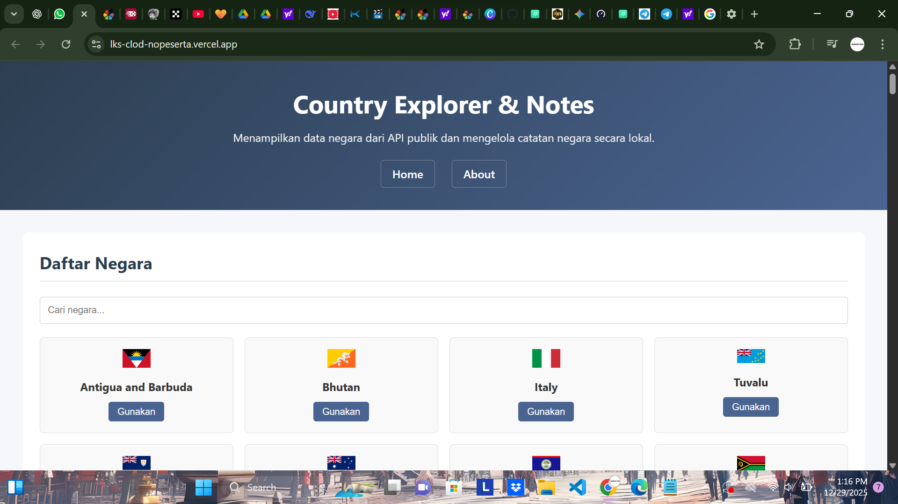
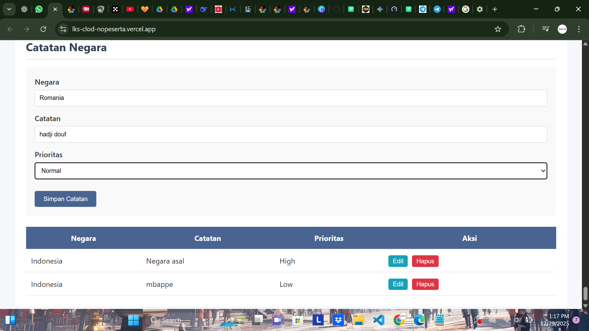

# Cloud Deployment – Web Aplikasi CRUD dengan API Publik


Aplikasi ini merupakan web aplikasi statis yang di-deploy ke lingkungan cloud menggunakan Vercel.
Aplikasi menerapkan operasi CRUD (Create, Read, Update, Delete) dengan sumber data JSON lokal serta konsumsi data dari API publik menggunakan JavaScript.

Proyek ini dibuat untuk memenuhi kebutuhan penilaian lomba Cloud Computing dengan fokus pada:

Deployment berbasis cloud
Manajemen repository yang benar
Keamanan aplikasi dasar
Implementasi CRUD sisi cliens


2. Ruang Lingkup Aplikasi

Aplikasi tidak menggunakan backend server atau database eksternal.
Seluruh proses dilakukan di sisi client (frontend).
Ruang lingkup dibatasi untuk:
Web statis (HTML, CSS, JavaScript)
Data lokal berbentuk JSON
Penyimpanan sementara menggunakan localStorage
Konsumsi API publik (read-only)
Pembatasan ini disengaja agar fokus pada deployment cloud dan best practice repository.


## Installation

Install my-project with git

```bash
  git clone "https://github.com/arganaart-prog/lks-clod-nopeserta..git"
  cd my-project
```

## Tech Stack

**Client:** Html, css, javascript

**Server:** json local


## Tampilan Utama


## tampilan crud


